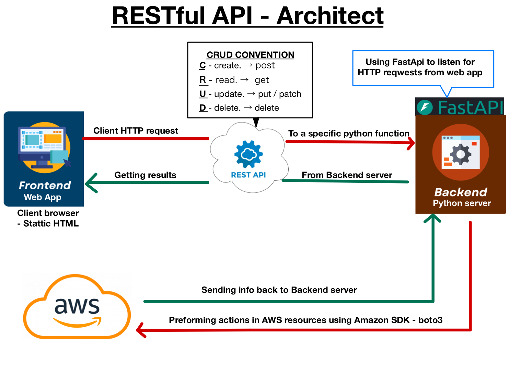

# AWS Management Console - Web UI 

## **Overview 📄**
This project is a **FastAPI-based AWS provisioning system** with a **web-based UI** that allows users to manage AWS resources including:
- **EC2 Instances** (Create, start, stop, terminate)
- **S3 Buckets** (Create, list, delete, upload files)
- **Route 53 DNS Management** (Manage hosted zones & records)

The system uses **FastAPI for the backend** and a **static HTML frontend** with JavaScript to interact with the backend APIs.



## **Features ✨**
- 📡 **Manage EC2 Instances** (Create, Start, Stop, Terminate)
- ☁️ **Manage S3 Buckets** (Create, List, Upload Files, Delete)
- 🌐 **Manage Route 53** (Create Zones, Add/Update/Delete DNS Records)
- 🚀 **Runs in Docker** (No need to install dependencies manually)
- 🔐 **Secure AWS authentication** (via `~/.aws/credentials` or environment variables)

---
## **Demo 🎥**


## **Installation and Setup ⚙️**
There are two ways to run this project:  
1. **Local Setup - Using Python 🐍**
2. **Docker Setup - Using Docker engine 🐳**

### **1️⃣ Running Locally 🐍**
#### **Prerequisites 📦**
- **Python 3.9+**
- **AWS CLI configured** (`aws configure`)
- **Boto3 installed** - Installed automatically via pip install (see below).

#### **Step 1:aws configure**
To interact with AWS, the system needs valid credentials.  
You can provide credentials in
 the following command on your local machine:
```bash
aws configure
```

#### **Step 2: Clone the Repository**
```bash
git clone  https://github.com/itai53/AWS-self-service-UI-project.git
cd AWS-self-service-UI-project
```

#### **Step 3: Install Dependencies**
```bash
pip install -r requirements.txt
```

#### **Step 4: Run the FastAPI Server** 
```bash
python3 -m backend.main 
```

#### **Step 5: Open the Web UI**
Once the server is running, open your browser and go to:
```
http://127.0.0.1:8000
```

---

### **2️⃣ Running with Docker 🐳**
#### **Prerequisites 📦**
- **Docker installed** ([Download Docker](https://docs.docker.com/get-docker/))
- **AWS Credentials configured on your local machine** (`aws configure`)


#### **Step 1:aws configure**
To interact with AWS, the system needs valid credentials.  
You can provide credentials in
 the following command on your local machine:
```bash
aws configure
```
#### **Step 2: Clone the Repository**
```bash
git clone  https://github.com/itai53/AWS-self-service-UI-project.git
cd AWS-self-service-UI-project
```

#### **Step 3: Run with Docker Compose**
```bash
docker-compose up --build
```
#### **⚠️ Important: If you are accessing the web UI using a container, please provide on the web page the SSH key as follows when trying to create an EC2 instance:**
```bash
/UI_user/.ssh/<your_public_key>
```

#### **Step 4: Open the Web UI**
Once the container is running, open your browser and go to:
```
http://127.0.0.1:8000
```

---
## **NOTE ❗️**
### **1️⃣ you can modify the way that `docker-compose.yml` will read the access keys:**
#### **- option 1: By default the docker-compose mounts your local credentials ans SSH keys in read only permisson (recommended)**:
```yaml
volumes:
  - ~/.aws:/root/.aws:ro
  - ~/.ssh:/root/.ssh:ro
```
#### **🔴 Make sure that your ssh keys are under the ~/.shh file and then it will mount the keys to `/root/.ssh/<your_SSH_keys>` on your container**
#### **- option 2: Alternatively, modify the docker-compose file and pass on the access keys or SHH keys (not recommended - less secure)**
```yaml
environment:
  - AWS_ACCESS_KEY_ID=your_access_key
  - AWS_SECRET_ACCESS_KEY=your_secret_key
  - AWS_DEFAULT_REGION=us-east-1
  - SSH_PRIVATE_KEY=/root/.ssh/your_private_key.pem
```
#### ⚠️ Security Warning:
It’s recommended not to hardcode credentials inside docker-compose.yml.
Refer to this [Docker documentation](http://docs.docker.com/compose/how-tos/environment-variables/variable-interpolation/) for guidance on how to reference a `.env` file in Docker Compose to use variables insted.


### **2️⃣ To connect to an  EC2 instances via SSH, generate an SSH key pair in PEM format on your locall system:**
```bash
ssh-keygen -t rsa -b 4096 -m PEM -f mykey.pem
```
This will generate mykey.pem (private key) and mykey.pem.pub (public key).


---

## **Usage Guide and API endpoints**
### **🖥️ EC2 Instance Management**
| Action  | Endpoint | Method | Required Parameters |
|---------|---------|--------------|----------------------|
| **Create** | `/api/ec2/create` | POST | `instance_name`, `instance_type`, `ami`, `pubkey_path` |
| **List** | `/api/ec2/list` | GET | None |
| **Start** | `/api/ec2/start` | POST | `instance_identifier` (ID or Name) |
| **Stop** | `/api/ec2/stop` | POST | `instance_identifier` (ID or Name) |
| **Terminate** | `/api/ec2/terminate` | POST | `instance_identifier` (ID or Name) |

### **📂 S3 Bucket Management**
| Action  | Endpoint | Method | Required Parameters |
|---------|---------|--------------|----------------------|
| **Create** | `/api/s3/create` | POST | `bucket_name`, `access` (private/public) |
| **List** | `/api/s3/list` | GET | None |
| **Upload File** | `/api/s3/upload` | POST | `bucket_name`, `file` |
| **Delete** | `/api/s3/delete/{bucket_name}` | DELETE | `bucket_name` |

### **🌐 Route53 DNS Management**
| Action  | Endpoint | Method | Required Parameters |
|---------|---------|--------------|----------------------|
| **Create Zone** | `/api/route53/zone/create` | POST | `zone_name` |
| **List Zones** | `/api/route53/zone/list` | GET | None |
| **Delete Zone** | `/api/route53/zone/delete` | DELETE | `zone_id` |
| **Create Record** | `/api/route53/record/create` | POST | `zone_id`, `record_name`, `record_type`, `record_value` |
| **Update Record** | `/api/route53/record/update` | PUT | `zone_id`, `record_name`, `record_type`, `record_value` |
| **Delete Record** | `/api/route53/record/delete` | DELETE | `zone_id`, `record_name` |

---

## **Troubleshooting ⚡️**
### **"Unable to locate credentials" error**
- Ensure you have run `aws configure` locally.
- If using Docker, make sure you mounted `~/.aws` in `docker-compose.yml`.

### **"Error creating EC2 instance"**
- Check if your AWS IAM user has the right permissions.
- Ensure the **AMI ID** is correct and supported in your AWS region.

### **"Bucket Name Invalid"**
- Ensure the bucket name follows AWS rules (e.g., lowercase, no spaces).

---
## Folder structure 🗄️
```bash
.
├── README.md                     # Documentation
├── STUFF
│   ├── API-ERST.jpeg             # pic
│   └── demo.gif                  # UI demo 
├── backend                       # Backend (FastAPI app)
│   ├── api                       # API routes
│   │   ├── ec2.py                # EC2 endpoints
│   │   ├── route53.py            # Route53 endpoints
│   │   └── s3.py                 # S3 endpoints
│   ├── functions
│   │   ├── ec2_functions.py      # EC2 functions in python
│   │   ├── ec2configuration      # Config for SG, subnet ID & scripts
│   │   │   ├── configuration.txt
│   │   │   ├── user_data_amazon-linux.sh
│   │   │   └── user_data_ubuntu.sh
│   │   ├── route53_functions.py   # route53 functions in python
│   │   └── s3_functions.py        # S3 functions in python
│   └── main.py                    # FastAPI entry point
├── docker-compose.yml             # Docker Compose
├── dockerfile                     # Docker file 
├── frontend
│   └── index.html                 # Main UI page
└── requirements.txt               # Python dependencies 
```
---
## Summary 📚

By following the installation and configuration steps above, you can quickly set up and use this tool to self-provision AWS resources.
- PRs are welcome! Fork, commit, and create a Pull Request.
- 🔥 If this project helps you, give it a ⭐ on GitHub!

**Happy provisioning! 🎉**

